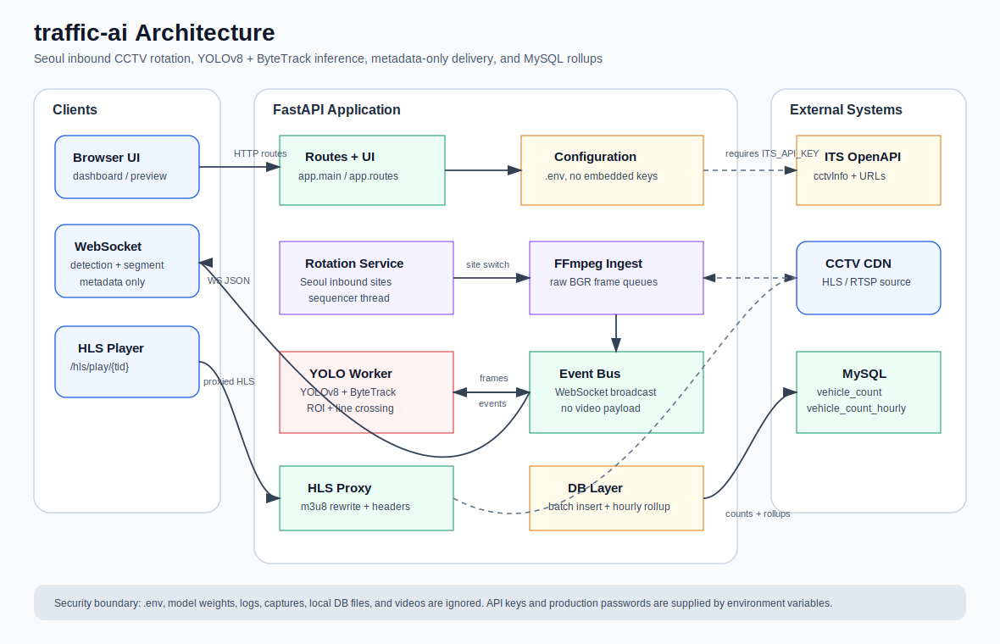
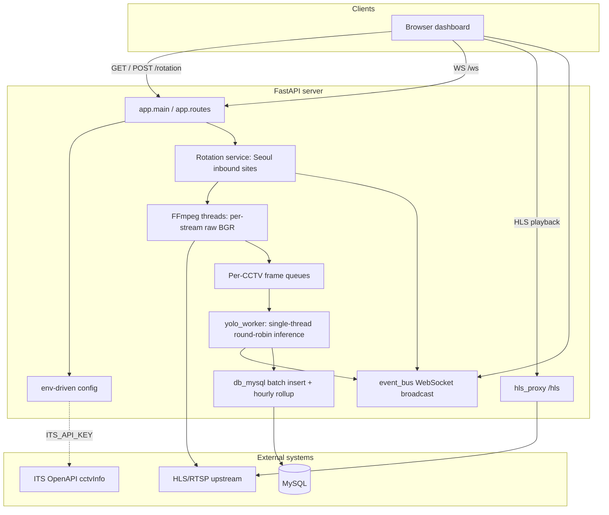

# Demo
[GitHub Demo Link](https://jangdonggun.duckdns.org/traffic/)
# traffic-ai

A **FastAPI** service that ingests **CCTV HLS/RTSP streams** (e.g. from the national ITS center), tracks vehicles with **YOLOv8 + ByteTrack**, aggregates **up/down traffic** using a **hybrid rule set** (virtual line crossing “hard” counts plus flow-based “soft” correction), batch-writes results to **MySQL**, and pushes **metadata only** to dashboards over **WebSocket** (no raw video on the wire).

Repository: [github.com/StargazyP/traffic-ai](https://github.com/StargazyP/traffic-ai)

---

## Expected outcomes

- **Multi-site operation**: Rotate across Seoul inbound CCTV sites with one shared GPU and a single YOLO worker thread.
- **Efficient telemetry**: Avoid streaming full frames over WebSocket; send bounding boxes, counts, and optional ROI debug snapshots (JPEG base64) only.
- **Operational flexibility**: Resolve stream URLs via the ITS OpenAPI or pin per-site URLs through environment configuration.
- **Stable browser playback**: Mitigate Referer/cookie issues for KT/ITS-style HLS using the built-in **`/hls` proxy**.
- **Quantitative records**: Persist site, direction, and hard/soft splits in the schema for traffic analysis and monitoring.

---

## Architecture overview

### Data flow (summary)

1. **Ingest**: Per site, FFmpeg decodes HLS/RTSP to `rawvideo` BGR frames; each CCTV name gets a **short queue** keeping mostly the latest frame.
2. **Inference**: One global **YOLO** model plus **per-CCTV ByteTrack** state; only vehicle-related COCO classes are kept.
3. **Counting**: Inside the ROI, a virtual line (`LINE_Y_RATIO`, etc.) drives **hard** (line crossing) vs **soft** (near-line flow) decisions; each `track_id` is counted once until it goes stale.
4. **Delivery**: `event_bus` pushes JSON with `type: detection` and `type: segment` to `/ws` subscribers—no video payload.
5. **Persistence**: `yolo_mysql_counter` batches into `db_mysql.insert_batch`; `db_mysql` also maintains hourly rollups in `vehicle_count_hourly`.

### Recent updates

- Seoul inbound CCTV rotation now uses site-specific ROI and virtual-line tuning from `app/config.py`.
- ITS API access no longer has an embedded fallback key; set `ITS_API_KEY` in `.env` or provide `CCTV_URL*` values directly.
- Docker and DB defaults now read from environment variables, and runtime artifacts such as `.env`, model weights, logs, captures, local DB files, and videos are ignored.
- MySQL persistence includes a `vehicle_count_hourly` rollup migration for lower long-running storage pressure.

### Main modules

| Path | Role |
|------|------|
| `app/main.py` | FastAPI app, rotation and YOLO workers, WebSocket, minimal HTML dashboard |
| `app/config.py` | Loads `.env` via `python-dotenv`; CCTV, YOLO, and HLS proxy settings |
| `app/hls_proxy.py` | `/hls/register`, `/hls/play/{tid}` — m3u8 rewrite and Referer fallback |
| `app/its_client.py` / `app/its_rotation.py` | ITS API listing and pattern matching for the Seoul inbound rotation sites |
| `yolo_mysql_counter.py` | Single-CCTV counter paths (`run_counter_stream`, etc.) and FFmpeg piping |
| `db_mysql.py` | MySQL connectivity, hybrid-column-aware batch insert, and hourly rollup compression |
| `event_bus.py` | WebSocket fan-out |

### Configuration and repository hygiene

Copy `.env.example` to `.env` for local runtime values. Keep real API keys, stream URLs, DB passwords, model weights, captures, and local data out of Git; `.gitignore` and `.dockerignore` are configured for those artifacts.

---

## Compliance

Use of the ITS OpenAPI and third-party CCTV streams must follow each provider’s terms and key policies. This document describes the software design only; review security and network policies before any production deployment.
