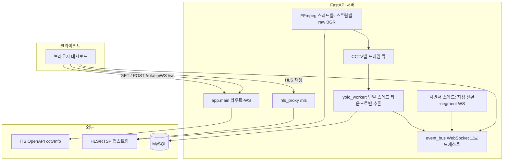

# traffic-ai

국가교통정보센터(ITS) 등 **CCTV HLS/RTSP 스트림**을 받아 **YOLOv8 + ByteTrack**으로 차량을 추적하고, **가상선 교차(hard)와 흐름 보정(soft)** 를 결합한 하이브리드 규칙으로 상·하행을 집계한 뒤 **MySQL**에 배치 저장하고, **WebSocket**으로 대시보드에 메타데이터만 실시간 전달하는 **FastAPI** 서버입니다.

저장소: [github.com/StargazyP/traffic-ai](https://github.com/StargazyP/traffic-ai)

---

## 기대 효과

- **다지점 운영**: 판교·하남·서창·김포·광명 등 복수 구간을 순차 로테이션하며 한 GPU에서 단일 YOLO 워커로 처리 가능한 구조.
- **실시간 가시성**: 영상 전체를 WS로 밀지 않고 검출 박스·카운트·ROI 디버그(JPEG base64, 옵션)만 전송해 대역폭을 절약.
- **운영 연동**: ITS OpenAPI로 스트림 URL을 자동 조회하거나, `.env`로 지점별 URL을 고정할 수 있음.
- **브라우저 재생**: KT/ITS 계열 HLS는 Referer·쿠키 이슈가 있어 **`/hls` 프록시**로 재생 안정화.
- **정량 데이터 축적**: 지점·상하행·hard/soft 구분이 포함된 스키마로 교통량 분석·모니터링에 활용 가능.

---

## 아키텍처 개요



### 데이터 흐름 (요약)

1. **스트림 인입**: 지점마다 FFmpeg가 HLS/RTSP를 `rawvideo` BGR로 디코드하고, CCTV 이름별 **짧은 큐**에 최신 프레임만 유지합니다.
2. **추론**: 전역 **YOLO 단일 모델** + CCTV별 **ByteTrack** 상태로 차량 클래스만 필터링합니다.
3. **카운트**: ROI 안 가상선(`LINE_Y_RATIO` 등) 기준 **hard(교차)** / **soft(근선·흐름 보정)** 를 구분해 동일 `track_id`는 한 번만 집계합니다.
4. **전달**: `event_bus`가 `/ws` 구독자에게 `type: detection`·`type: segment` JSON만 push합니다. (영상 바이너리 없음)
5. **저장**: `yolo_mysql_counter` → `db_mysql.insert_batch`로 MySQL `vehicle_count` 등에 배치 반영.

### 주요 모듈

| 경로 | 역할 |
|------|------|
| `app/main.py` | FastAPI 앱, 로테이션·YOLO 워커·WS·간단 HTML 대시보드 |
| `app/config.py` | `python-dotenv`로 `.env` 로드, CCTV·YOLO·HLS 프록시 설정 |
| `app/hls_proxy.py` | `/hls/register`, `/hls/play/{tid}` — m3u8 재작성·Referer 순회 |
| `app/its_client.py` / `app/its_rotation.py` | ITS API에서 목록 조회, 5지점 이름 패턴 매칭 |
| `yolo_mysql_counter.py` | 단일 CCTV 카운터 모드(`run_counter_stream` 등), FFmpeg 파이프 |
| `db_mysql.py` | MySQL 연결·하이브리드 컬럼 대응 배치 insert |
| `event_bus.py` | WebSocket 연결 풀과 브로드캐스트 |

---

## 요구 사항

- Python 3.10+ 권장
- **FFmpeg** (스트림 디코드)
- **Ultralytics YOLO** 가중치: `run.sh`가 `models/yolov8n.pt` 미존재 시 자동 다운로드
- (선택) CUDA — `config`의 `USE_CUDA` 등에 따름
- (선택) MySQL — 카운트 저장 시 `MYSQL_*` 환경 변수

---

## 실행

프로젝트 루트에 `.env`를 두고(저장소에 포함하지 않음), 의존성 설치 후 서버를 띄웁니다.

```bash
chmod +x run.sh
./run.sh
```

기본으로 `uvicorn app.main:app --host 0.0.0.0 --port 8000 --reload` 가 실행됩니다.

주요 HTTP 엔드포인트 예:

- `GET /` — 로테이션 대시보드(시작/정지, 카운트·디버그 UI)
- `POST /rotation/start` · `POST /rotation/stop` — 5지점 순차 캡처·YOLO
- `GET /rotation/status` — 시퀀서·텔레메트리
- `WebSocket /ws` — 검출·세그먼트 이벤트
- `POST /hls/register` — 브라우저용 재생 URL 등록

환경 변수 이름은 `app/config.py`, `db_mysql.py`를 참고해 `.env`에 설정하세요. (**ITS API 키, DB 비밀번호, 지점별 CCTV URL 등은 비공개로 관리**)

---

## Docker

`Dockerfile`, `docker-compose.yml`이 포함되어 있을 수 있습니다. 컨테이너 실행 시에도 **`.env`는 이미지에 넣지 말고** 런타임 시 마운트·시크릿으로 주입하는 것을 권장합니다.

---

## 라이선스·데이터

ITS OpenAPI·CCTV 스트림 이용 시 **각 서비스 약관·키 발급 조건**을 준수해야 합니다. 본 README는 코드 구조 설명용이며, 운영 배포 전 보안·네트워크 정책을 별도 검토하세요.
