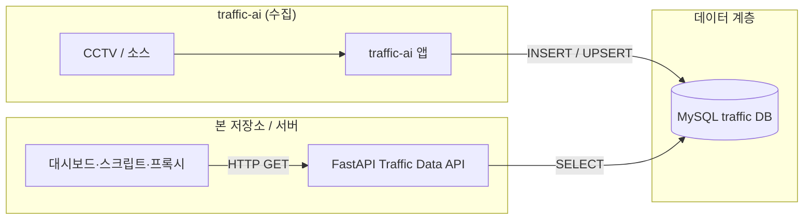

# Traffic Data API

`traffic-ai`가 MySQL에 적재한 차량 카운트 데이터를 **읽기 전용**으로 가공·조회하는 **FastAPI** 전용 서비스입니다. 수집·적재 로직은 `traffic-ai` 본 앱에 있고, 본 API는 DB 조회와 REST 응답만 담당합니다.

---

## 아키텍처



| 구분 | 설명 |
|------|------|
| **역할** | `vehicle_count`, `vehicle_count_hourly` 등 적재 테이블을 SQL로 집계·페이지네이션해 JSON으로 반환 |
| **런타임** | Python 3.11+, Uvicorn, `mysql-connector-python` |

---

## 실행 방법

소스 트리는 공개 저장소에 포함하지 않을 수 있습니다. **로컬 또는 비공개 경로**에 `main.py`, `db.py`, `queries.py`, `schemas.py` 등이 있다는 전제입니다.

```bash
cd traffic_data_api
python -m venv .venv
source .venv/bin/activate   # Windows: .venv\Scripts\activate
pip install -r requirements.txt
uvicorn main:app --host 0.0.0.0 --port 8001
```

- **OpenAPI 문서**: 서버 기동 후 브라우저에서 `http://<호스트>:8001/docs` (Swagger), `http://<호스트>:8001/redoc` (ReDoc).
- **CORS**: `allow_origins=["*"]` 로 설정되어 있어 브라우저에서 다른 오리진으로 호출하기 쉽습니다(운영에서는 제한 권장).

---

## API 개요

공통 베이스 URL 예: `http://localhost:8001`  
응답은 JSON이며, 필드 상세는 `/docs`의 스키마를 기준으로 하면 됩니다.

### `GET /health`

DB에 `SELECT 1`로 연결 가능 여부를 확인합니다.

- **200**: `{"status":"ok","database":"reachable"}`
- **503**: DB 연결 실패 시 `database_unavailable: ...` 형태의 `detail`

---

### `GET /api/v1/sites`

등장한 적이 있는 **모든 CCTV(지점) 이름**을 중복 없이 정렬해 반환합니다.  
(`vehicle_count` / `vehicle_count_hourly` 양쪽에서 `DISTINCT` 후 `UNION`)

**응답**: `{ "cctv_name": string }[]`

---

### `GET /api/v1/counts/latest`

지점별 **`vehicle_count`에서 가장 최근 id 한 건**(지점당 1행)을 반환합니다.  
`total_estimate`는 `count`가 있으면 그 값, 없으면 `up_count + down_count`로 추정합니다.

**응답**: `LatestCountItem[]` (id, cctv_name, count/up/down 계열, `total_estimate`, `created_at` 등)

---

### `GET /api/v1/counts/raw`

원시 행 단위 조회(페이지네이션).

| 쿼리 파라미터 | 타입 | 설명 |
|---------------|------|------|
| `cctv_name` | string, 선택 | 지점 이름 필터 |
| `start` | datetime, 선택 | `created_at` 이상 (UTC 권장) |
| `end` | datetime, 선택 | `created_at` 미만 |
| `limit` | int, 기본 100 | 1~500 |
| `offset` | int, 기본 0 | 오프셋 |

**응답**: `{ "meta": { "limit", "offset", "returned" }, "items": RawCountItem[] }`

**예시**

```bash
curl -G "http://localhost:8001/api/v1/counts/raw" \
  --data-urlencode "cctv_name=some_site" \
  --data-urlencode "limit=50" \
  --data-urlencode "offset=0"
```

---

### `GET /api/v1/counts/hourly`

시간 버킷(`hour_bucket`) 기준 집계 행 목록.

| 쿼리 파라미터 | 설명 |
|---------------|------|
| `cctv_name` | 선택, 지점 필터 |
| `start` | `hour_bucket` 이상 |
| `end` | `hour_bucket` 미만 |
| `limit` | 기본 168, 최대 2000 |
| `offset` | 기본 0 |

**응답**: `HourlyItem[]` (버킷, 지점, up/down start·end·delta, `event_count` 등)

---

### `GET /api/v1/matrix/hourly-by-hour`

**하루(`day`)**와 **시간 구간(`from_hour` ~ `to_hour`, 0~23 포함)**을 정하면, 각 정각 시간대를 **한 행**으로 두고 행마다 여러 CCTV의 상·하행(`up_traffic` / `down_traffic`)을 묶어 줍니다. 데이터가 없는 시간도 빈 `sites: []`로 행이 채워집니다.

| 쿼리 파라미터 | 필수 | 설명 |
|---------------|------|------|
| `day` | 예 | `YYYY-MM-DD` |
| `from_hour` | 아니오, 기본 12 | 시작 시(포함) |
| `to_hour` | 아니오, 기본 15 | 끝 시(포함) |
| `cctv_name` | 아니오 | 지정 시 해당 지점만 |

**응답**: `HourlyMatrixResponse` — `grouped_by_hour`(시간별 CCTV 셀 배열), 동일 데이터를 펼친 `flat`(시간×지점 행)

**예시**

```bash
curl -G "http://localhost:8001/api/v1/matrix/hourly-by-hour" \
  --data-urlencode "day=2026-05-13" \
  --data-urlencode "from_hour=9" \
  --data-urlencode "to_hour=17"
```

---

### `GET /api/v1/summary/daily`

일자별 요약(지점·일 단위 집계).

| 쿼리 파라미터 | 설명 |
|---------------|------|
| `cctv_name` | 선택 |
| `range` | 선택. 단일 `YYYY-MM-DD` 또는 `YYYY-MM-DD,YYYY-MM-DD`(시작,종료). 미지정 시 **최근 7일** |

**응답**: `DailySummaryItem[]` (`day`, `cctv_name`, `samples`, `up_max`, `down_max`, `up_delta_est`, `down_delta_est` 등)

**예시**

```bash
curl -G "http://localhost:8001/api/v1/summary/daily" \
  --data-urlencode "range=2026-05-01,2026-05-13"
```
